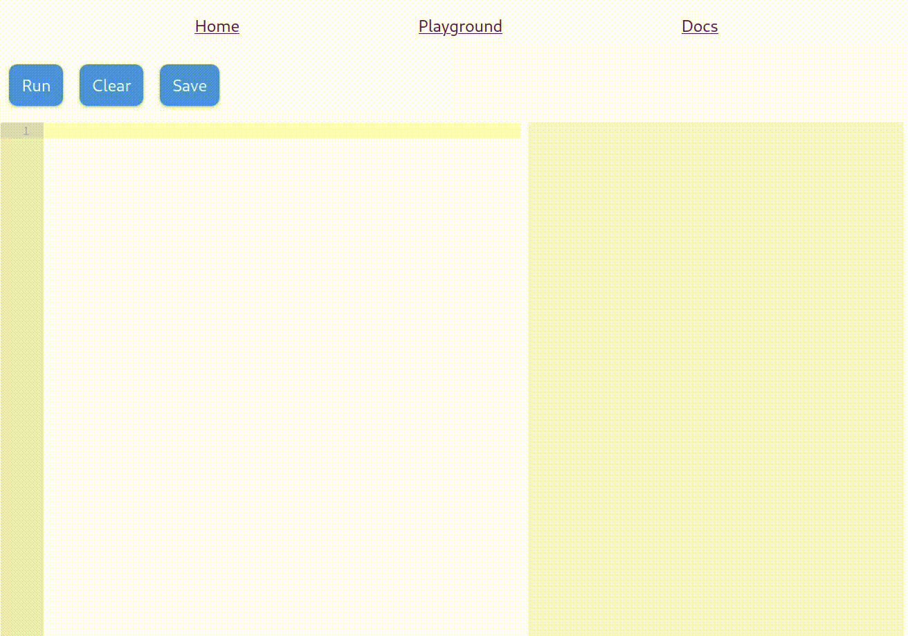

# Qiqe

This an experimental playground for a general purpose functional language. This is the implementation of a web application that allows to write and execute Qiqe code in the browser.

## What means Qiqe?

This is a mutated word from the spanish word "Quique", which is an animal that lives in the south of Chile. It's a little mammal that lives in the ground.

## Demo

The application consists of a code editor, a compiler, a controller and a web server. The controller is a Django application that interacts with the compiler and the web server. The compiler is a Haskell gRPC server that compiles the code to a javascript code. The code editor is a React application that allows to write Qiqe code and execute it in the browser.



## Documentation

You can find the documentation [here](qiqe/doc/README.md).

More examples can be found in the [examples](qiqe/doc/examples/) directory.

## Development

For development, you need to have [NixOS](https://nixos.org/) and [Flake](https://nixos.wiki/wiki/Flakes) installed. Then, you can run the following command to start the development server:

```sh
nix run .#dev
```

This will start a Postgres database and a web server. The web server (React) will automatically reload when you change the code. Other services (Compiler and Controller) will be reloaded when you run the command again.

## Deployment

> **TODO**: It is not deployed yet.

## Motivation

The idea of this project is experiment with a general purpose functional language. And in the future, allow to use visual programming.

## Contributing

If you want to contribute, you can open an issue or a pull request. You can also contact me at [Twitter](https://twitter.com/fabianmativeal).
