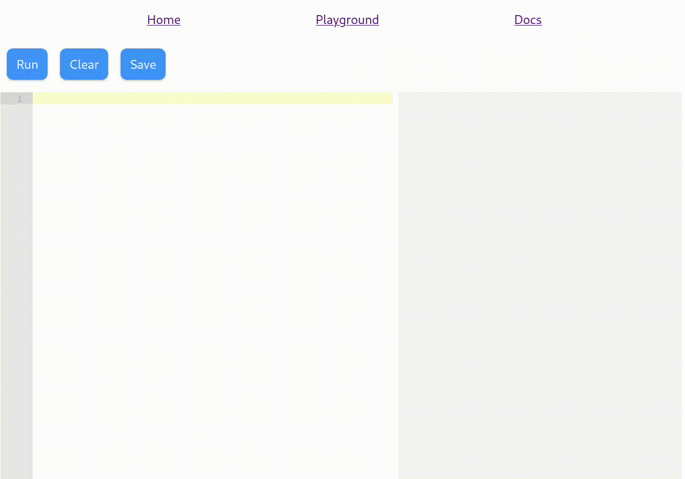

# Qiqe

This an experimental playground for a general purpose functional language. This is the implementation of a web application that allows to write and execute Qiqe code in the browser.

## What means Qiqe?

This is a mutated word from the spanish word "Quique", which is an animal that lives in the south of Chile. It's a little mammal that lives in the ground.

## Demo

The application consists of a code editor, an interpreter service, and a web server. The system uses nginx as a reverse proxy to route requests between the React frontend and the Haskell interpreter service. The interpreter service provides a JSON REST API that compiles and executes Qiqe code. The code editor is a React application that allows users to write Qiqe code and execute it in the browser.



## Architecture

For detailed system architecture information, see [ARCHITECTURE.md](ARCHITECTURE.md).

## Documentation

You can find the language documentation [here](qiqe/doc/README.md).

More examples can be found in the [examples](qiqe/doc/examples/) directory.

## Development

For development, you need to have [Docker](https://www.docker.com/) and [Docker Compose](https://docs.docker.com/compose/) installed. Then, you can run the following command to start the development server:

```sh
./scripts/start-dev.sh
```

This will start the complete development environment including:
- nginx reverse proxy on port 8080
- React frontend with hot reloading
- Haskell interpreter service with JSON REST API
- PostgreSQL database

The React frontend will automatically reload when you change the code. To rebuild other services, stop the containers and run the start script again.

## Production Deployment

For production deployment, use the production Docker Compose configuration:

```sh
./scripts/start-prod.sh
```

This will start the production environment with:
- nginx reverse proxy on port 80
- Optimized React frontend build
- Haskell interpreter service
- PostgreSQL database with production configuration

The production setup includes proper logging, health checks, and optimized configurations for better performance.

## Motivation

The idea of this project is experiment with a general purpose functional language. And in the future, allow to use visual programming.

## Contributing

If you want to contribute, you can open an issue or a pull request. You can also contact me at [Twitter](https://twitter.com/fabianmativeal).
